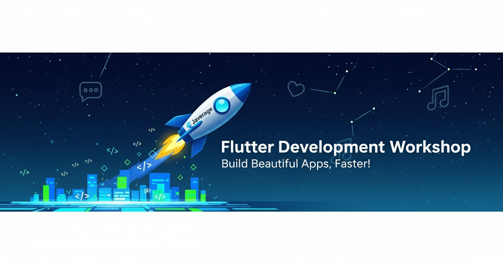

# Flutter Frontend Foundation: Your App Development Adventure
Welcome to Your Flutter Adventure!
Hello, future app developer! This repository is your personal training ground to launch into the incredible world of Flutter. Forget boring guides; the rule here is learning by doing.

We've designed a series of five hands-on practices that will take you from the fundamentals of UI construction to building a functional, multi-screen application with a clean architecture. Think of this not as a course, but as a practical workshop where you and your teammate are the main characters.

The goal is for you to collaborate, experiment, break things, and most importantly, build something you're proud of. Get ready to bring your ideas to life!

🎯 What You'll Learn Here
By completing all the practices in this repository, you won't just have functional apps in your portfolio—you'll have mastered essential skills that recruiters look for:

Solid Project Architecture: You'll learn to structure your code like a pro, using a clean, feature-first architecture that's easy to maintain and scale.    
Mastery of Responsive Layouts: You'll build interfaces that look great on any device, mastering Row, Column, Stack, and the techniques for creating adaptive UIs.    
Interactive & Validated Forms: You'll create forms that respond to user input, capturing data and applying validation rules for a flawless user experience.    
Modern State Management: You'll understand how to manage your app's "brain," using StatefulWidget for local state and Cubit for more advanced, efficient state management.    
Declarative Navigation with Go_Router: You'll implement a modern and powerful routing system, learning to move between screens, pass complex data, and protect routes just like in real-world applications.    
Dynamic Data Display: You'll master the technique of displaying long lists of data smoothly and efficiently with ListView.builder and GridView.builder.    
🛠️ Before You Start: Your Toolkit
Although you should already have everything set up for the course, it's always good to have the official guides handy. If you need to install or review your development environment setup, here are the direct links:

Install the Flutter SDK: The foundation for everything.

- [Official Flutter Installation Guide](https://flutter.dev/docs/get-started/install)

Install Visual Studio Code (Recommended): A lightweight and powerful code editor, perfect for Flutter.

- [Visual Studio Code](https://code.visualstudio.com/)

- [Flutter](https://marketplace.visualstudio.com/items?itemName=Dart-Code.flutter)

Install Android Studio: Necessary for the Android SDK and emulators.

- [Android Studio](https://developer.android.com/studio)

📂 How It's Organized
To keep everything clear and tidy, each practice is a complete, self-contained Flutter project. This allows you to focus on one lesson at a time without distractions.

/
├── README.md
├── practice_01_mastering_layouts/
├── practice_02_interactive_forms/
├── practice_03_multi_screen_navigation/
├── practice_04_dynamic_product_list/
└── practice_05_ecommerce_showcase/

🚀 Let's Get Coding!
Ready to start programming? Follow these simple steps to run the first practice:

Clone the repository to your local machine:

```Bash:
git clone https://github.com/flutter-launchpad/flutter_frontend_foundation.git
Navigate to the directory of the first practice:
```

```Bash:
cd flutter_frontend_foundation/practice_01_mastering_layouts
Open the folder in Visual Studio Code or your preferred editor.
```

Install the project dependencies. Open a terminal within VS Code and run:

```Bash:
flutter pub get
Run the app on an emulator or your physical device. You're now ready to start building!
```

📚 Roadmap: The Practices
This is your treasure map. Each practice is another step on your journey to becoming a Flutter developer.

[Practice 01: Mastering Layouts](./practice_01_mastering_layouts/)

Mission: Build the foundation. You'll create a static, visually appealing profile card, learning to use Container, Row, and Column.    

[Practice 02: Interactive Forms](./practice_02_interactive_forms/)

Mission: Bring the UI to life. You'll develop a complete login form with real-time data validation.

[Practice 03: Multi Screen Navigation](./practice_03_multi_screen_navigation/)

Mission: Connect the dots. You'll implement a real authentication flow, navigating between screens with go_router and managing user state with Cubit.

[Practice 04: Dynamic Product List](./practice_04_dynamic_product_list/)

Mission: Work with data. You'll transform a simple screen into a dynamic and efficient product catalog using ListView.builder.

[Practice 05: Ecommerce Showcase](./practice_05_ecommerce_showcase/)

Mission: Integrate all your power. You'll create an e-commerce UI with carousels, grids, and navigation to detail screens, passing complex data between them.

💬 You're not alone on this journey! If you have questions, ideas, or just want to share your progress, follow us and join the conversation.

-  GitHub: [@javerage](https://github.com/javerage/)
-  X (Twitter): [@javerage](https://twitter.com/javerage/)
-  Instagram: [@javeragedev](https://www.instagram.com/javeragedev/)

If you find a bug or have a suggestion to improve a practice, the best way to help is by opening an "Issue" directly in this GitHub repository.

📄 License
This project is distributed under the MIT License. You are free to use, modify, and share this code as you wish. Happy coding!